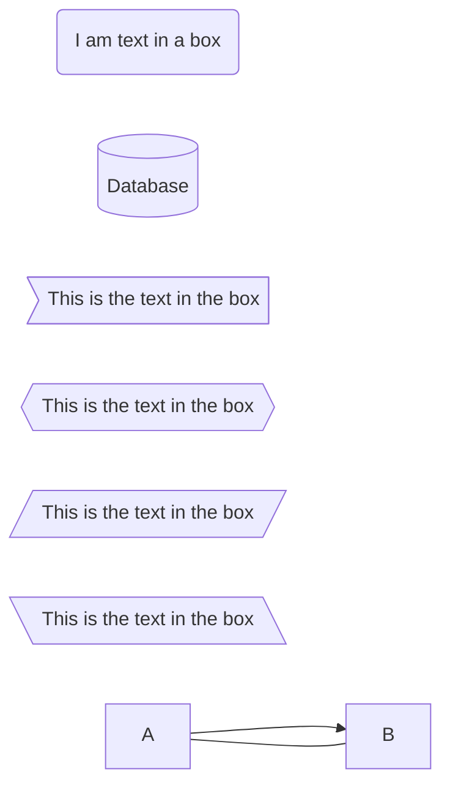
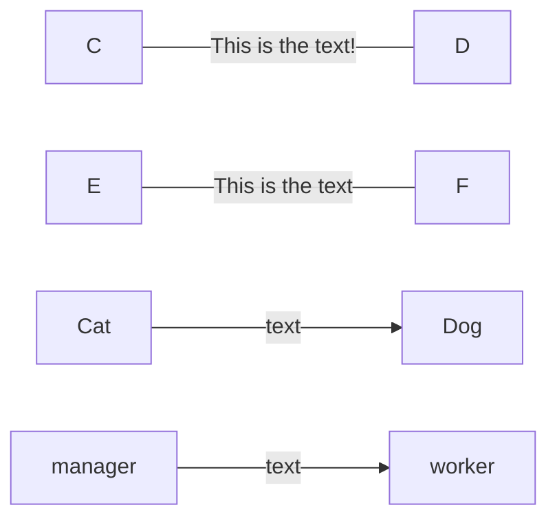
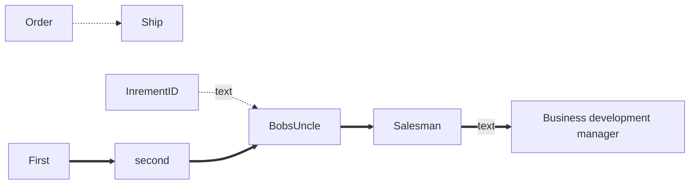
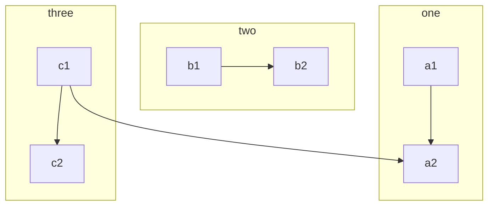

# ChoreMe
A simple. mobile-first web app to manage chores/tasks and rewards for parents and their children. It is designed to self-host on minimal hardware because the world doesn't need to know what your kids do for chores.

It is developed using Python (Flask) and MongoDB for the application and database respectively. The front end is built using Nextjs + ReactJS.

[Netxjs](https://nextjs.org/)



#### Does this work now?
It seems to. Looks like you need to close the mermaid code block for each diagram






```mermaid
flowchart TB
    Cheese --> Bacon
    Cheese --> Lettuce
    Bun --> Bacon
    Bun --> Lettuce
   ``` 
 ```mermaid
    graph TD
    A[Christmas] -->|Get money| B(Go shopping)
    B --> C{Let me think}
    C -->|One| D[Laptop]
    C -->|Two| E[iPhone]
    C -->|Three| F[fa:fa-car Car]
   ``` 

```mermaid
    erDiagram
          CUSTOMER }|..|{ DELIVERY-ADDRESS : has
          CUSTOMER ||--o{ ORDER : places
          CUSTOMER ||--o{ INVOICE : "liable for"
          DELIVERY-ADDRESS ||--o{ ORDER : receives
          INVOICE ||--|{ ORDER : covers
          ORDER ||--|{ ORDER-ITEM : includes
          PRODUCT-CATEGORY ||--|{ PRODUCT : contains
          PRODUCT ||--o{ ORDER-ITEM : "ordered in"
  ```
  
### Here's some coloring

  ```mermaid
graph LR

A & B--> C & D
style A fill:#f9f,stroke:#333,stroke-width:px
style B fill:#bbf,stroke:#f66,stroke-width:2px,color:#fff,stroke-dasharray: 5 5

subgraph beginning
A & B
end

subgraph ending
C & D
end
```


Here's more examples.



Why is this broken

```mermaid
sequenceDiagram
    Alice->>Bob: Hello Bob, how are you?
    alt is sick
        Bob->>Alice: Not so good :(
    else is well
        Bob->>Alice: Feeling fresh like a daisy
    end
    opt Extra response
        Bob->>Alice: Thanks for asking
    end
 ```
