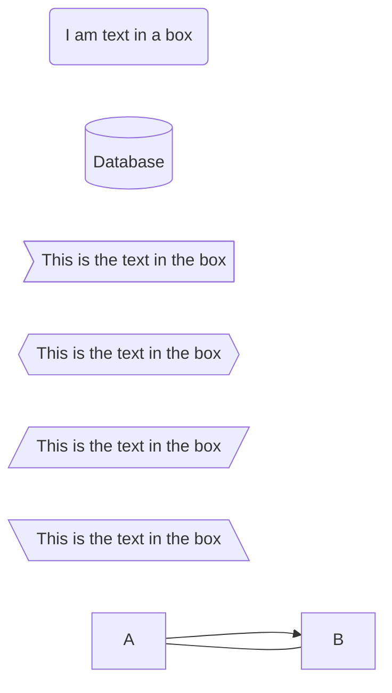
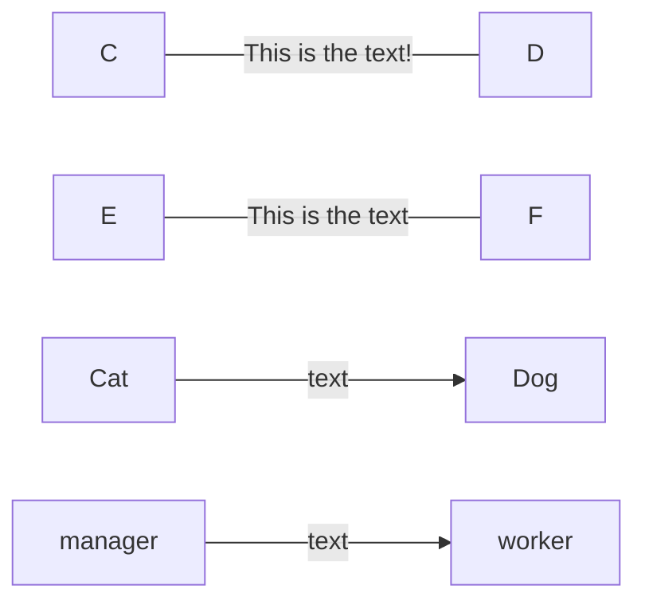
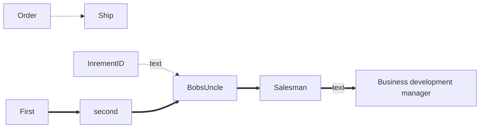
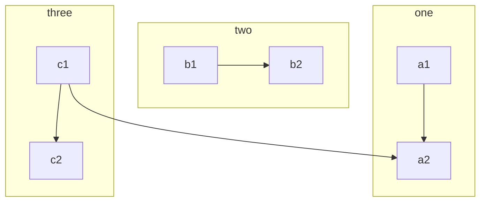
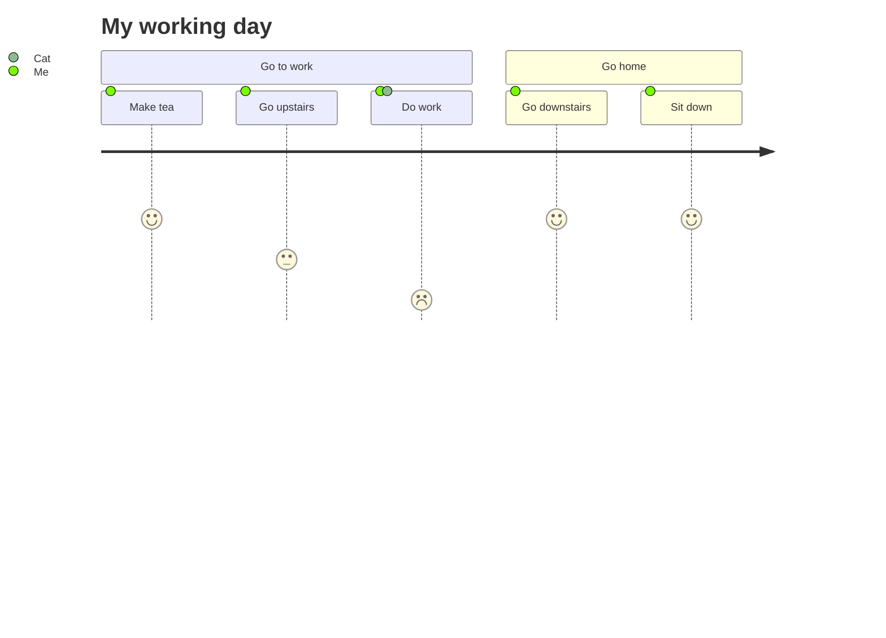
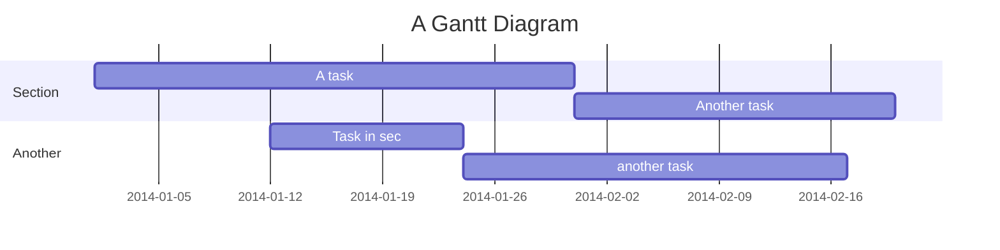
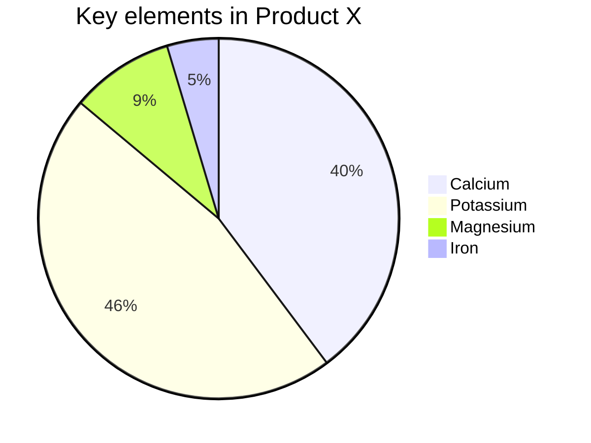
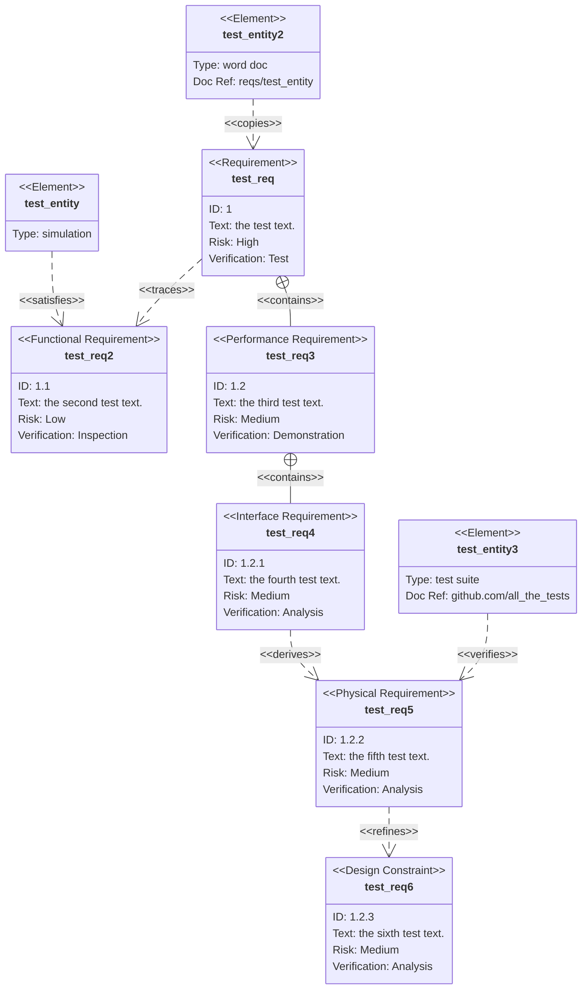

# Here are some example diagrams using MermaidJS

I will extend these in the future for my own reference.
each diagram needs to be separated in its own code block or it won't render. Then you can put text between the diagrams using normal markdown. 


## A Basic Test
Notice in the code that each element has a unique identifier that is referenced throughout the diagram. See A and B below.




## Examples

Most of the examples below come from the sources here, though I likely tweaked them along the way
* In someone's blog [https://blog.devgenius.io/diagrams-in-your-github-files-with-mermaid-273003d54421]
* On the official site [https://mermaid-js.github.io/mermaid/#/flowchart]
* Test the code here, then paste it here between ```mermaid ``` blocks [https://mermaid.live/]

## Another simple one


## One with more words
Note that the IDs cannot have spaces in them, but the labels can. Here the ID is BDM in the code, but you see the label "Business development manager"


### Fun with links


```mermaid
flowchart TB
    Cheese --> Bacon
    Cheese --> Lettuce
    Bun --> Bacon
    Bun --> Lettuce
    Bun --> d1[(Database)]
     
 ```  
## Line examples
You can play with line types. There appear to be lots of synonyms.

```mermaid
flowchart LR
 A-->B
 B --- C
 C-- This is the text! ---D
  D---|This is the text|F
  F-->|text|G
  G-- text -->H
  H-.->I;
```
Breaking to catch my breath

  ```mermaid
flowchart TB
  A-. text .-> B
  B ==> C
  C == text ==> D
  D -- text --> E -- text2 --> F
  F --o G
    G --x H
     H <--> I
 ```  
 
Same one, Left to Right this time

  ```mermaid
flowchart LR
  A-. text .-> B
  B ==> C
  C == text ==> D
  D -- text --> E -- text2 --> F
  F --o G
    G --x H
     H <--> I
 ```  
 
### Minimum length of a link
Each node in the flowchart is ultimately assigned to a rank in the rendered graph, i.e. to a vertical or horizontal level (depending on the flowchart orientation), based on the nodes to which it is linked. By default, links can span any number of ranks, but you can ask for any link to be longer than the others by adding extra dashes in the link definition.

In the following example, two extra dashes are added in the link from node B to node E, so that it spans two more ranks than regular links:

```mermaid
flowchart TD
    A[Start] --> B{Is it?}
    B -->|Yes| C[OK]
    C --> D[Rethink]
    D --> B
    B ---->|No| E[End]
 ```
    
## Words, and icons. 

I think this uses Fontawesome. Yep, [https://mermaid-js.github.io/mermaid/#/flowchart?id=basic-support-for-fontawesome]. Nuts doesn't seem to work in Github. The "car" block was supposed to have a car symbol in it.

 ```mermaid
    graph TD
    A[Christmas] -->|Get money| B(Go shopping)
    B --> C{Let me think}
    C -->|One| D[Laptop]
    C -->|Two| E[iPhone]
    C -->|Three| F[fa:fa-car Car]
   ``` 


  
### Here's some coloring

From the docs

#### Styling and classes

##### Styling links

It is possible to style links. For instance you might want to style a link that is going backwards in the flow. As links have no ids in the same way as nodes, some other way of deciding what style the links should be attached to is required. Instead of ids, the order number of when the link was defined in the graph is used. In the example below the style defined in the linkStyle statement will belong to the fourth link in the graph:
```
css linkStyle 3 stroke:#ff3,stroke-width:4px,color:red;
```

##### Styling a node
It is possible to apply specific styles such as a thicker border or a different background color to a node.

```
flowchart LR
    id1(Start)-->id2(Stop)
    style id1 fill:#f9f,stroke:#333,stroke-width:4px
    style id2 fill:#bbf,stroke:#f66,stroke-width:2px,color:#fff,stroke-dasharray: 5 5
 ```
    
    
```mermaid    
flowchart LR
 id1(Start)-->id2(Stop)
 style id1 fill:#f9f,stroke:#333,stroke-width:4px
 style id2 fill:#bbf,stroke:#f66,stroke-width:2px,color:#fff,stroke-dasharray: 5 5
 ```
 
#### Classes

More convenient than defining the style every time is to define a class of styles and attach this class to the nodes that should have a different look.

A class definition looks like the example below:

```
    classDef className fill:#f9f,stroke:#333,stroke-width:4px;
```    
    
Attachment of a class to a node is done as per below:

```
    class nodeId1 className;
```    
    
It is also possible to attach a class to a list of nodes in one statement:
```
    class nodeId1,nodeId2 className;
```

A shorter form of adding a class is to attach the classname to the node using the :::operator as per below:
```
flowchart LR
    A:::someclass --> B
    classDef someclass fill:#f96;
    A
    B
```

### CSS Classes
It is also possible to predefine classes in css styles that can be applied from the graph definition as in the example below:

Example style
```
<style>
    .cssClass > rect{
        fill:#FF0000;
        stroke:#FFFF00;
        stroke-width:4px;
    }
</style>
```

Example definition
```
flowchart LR;
    A-->B[AAA<span>BBB</span>]
    B-->D
    class A cssClass
A
AAA<span>BBB</span>
D
```

Default class
If a class is named default it will be assigned to all classes without specific class definitions. In the exampe below, A, B and C are customized. But Default seems to overide the styling

```
    classDef default fill:#f9f,stroke:#333,stroke-width:4px,color:#eee;
```
Example 1 with a default set

  ```mermaid
   graph LR

    A & B--> C & D
    classDef default fill:#02114a,stroke:#037c5e,color:#eee,stroke-width:2px;
    style A fill:#f9f,stroke:#333,color:red,stroke-width:1px
    style B fill:#bbf,stroke:#f66,stroke-width:2px,color:#fff,stroke-dasharray: 5 5

        subgraph beginning
        A & B
        end

        subgraph ending
        C & D
        end
```

Example 2 with no default

  ```mermaid
   graph LR

    A & B--> C & D
    style A fill:#f9f,stroke:#333,color:red,stroke-width:1px
    style B fill:#bbf,stroke:#f66,stroke-width:2px,color:#fff,stroke-dasharray: 5 5

        subgraph beginning
        A & B
        end

        subgraph ending
        C & D
        end
```

## More Examples

More diagram types



Why is this broken.. it was missing the d on end

```mermaid
sequenceDiagram
    Alice->>Bob: Hello Bob, how are you?
    alt is sick
        Bob->>Alice: Not so good :(
    else is well
        Bob->>Alice: Feeling fresh like a daisy
    end
    opt Extra response
        Bob->>Alice: Thanks for asking
    end
 ```
 ### More testing.
 
 Notice that the page renders slowly due to all the diagrams. That's OK.
 
 
 ```mermaid
stateDiagram-v2
    [*] --> Active
state Active {
        [*] --> NumLockOff
        NumLockOff --> NumLockOn : EvNumLockPressed
        NumLockOn --> NumLockOff : EvNumLockPressed
        --
        [*] --> CapsLockOff
        CapsLockOff --> CapsLockOn : EvCapsLockPressed
        CapsLockOn --> CapsLockOff : EvCapsLockPressed
        --
        [*] --> ScrollLockOff
        ScrollLockOff --> ScrollLockOn : EvScrollLockPressed
        ScrollLockOn --> ScrollLockOff : EvScrollLockPressed
    }
```

# Fun
These are getting fun now



# GANTT


# PIE




# REQUIREMENT


## Entity Relationship (ER) Diagram
```mermaid
    erDiagram
          CUSTOMER }|..|{ DELIVERY-ADDRESS : has
          CUSTOMER ||--o{ ORDER : places
          CUSTOMER ||--o{ INVOICE : "liable for"
          DELIVERY-ADDRESS ||--o{ ORDER : receives
          INVOICE ||--|{ ORDER : covers
          ORDER ||--|{ ORDER-ITEM : includes
          PRODUCT-CATEGORY ||--|{ PRODUCT : contains
          PRODUCT ||--o{ ORDER-ITEM : "ordered in"
  ```
