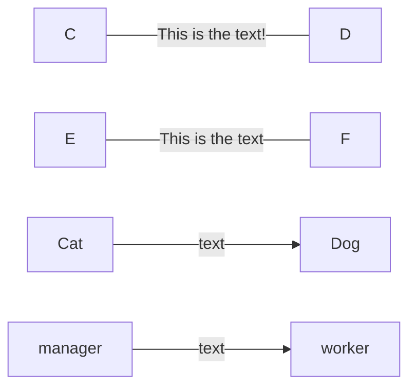
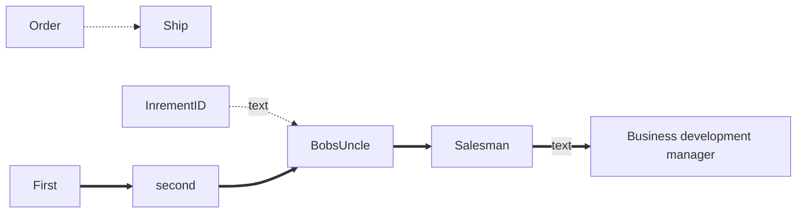
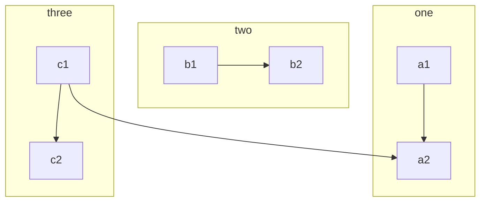
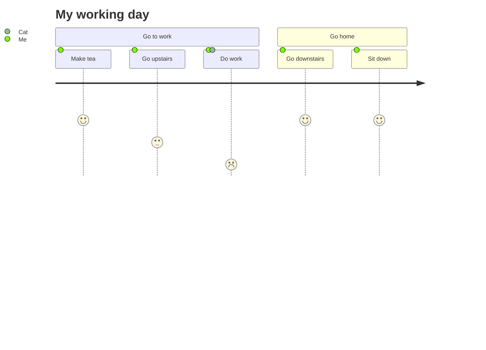
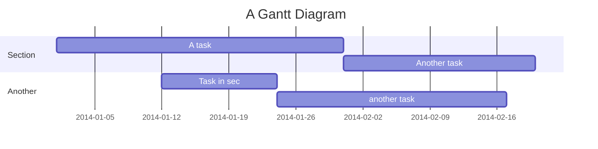
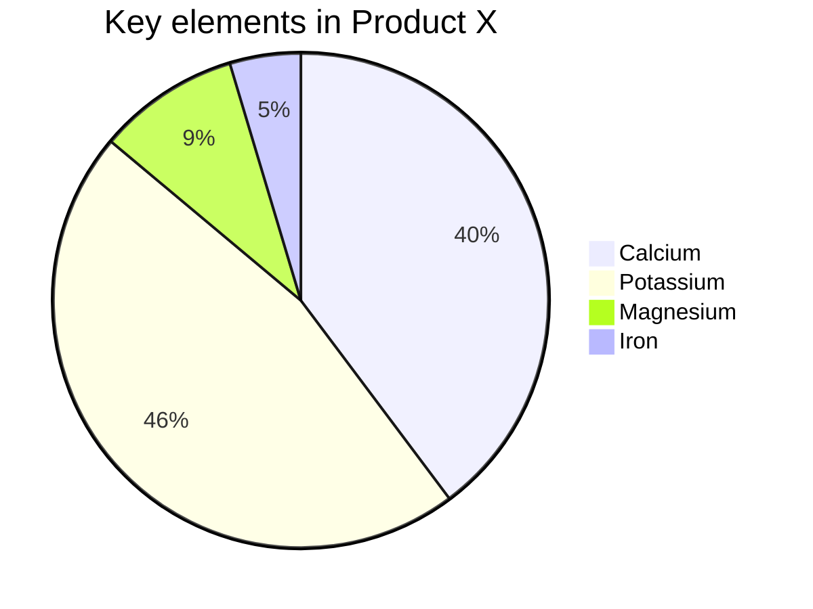
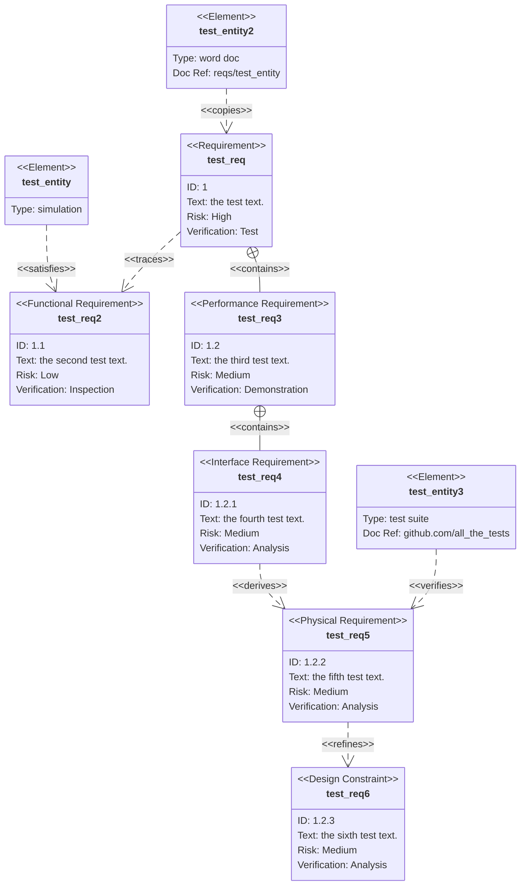

# Here are some example diagrams using MermaidJS

I will extend these in the future for my own reference.
each diagram needs to be separated in its own code block or it won't render. Then you can put text between the diagrams using normal markdown. 

# A Basic Test
Notice in the code that each element has a unique identifier that is referenced throughout the diagram. See A and B below.


#### Does this work now?
It seems to. Looks like you need to close the mermaid code block for each diagram






```mermaid
flowchart TB
    Cheese --> Bacon
    Cheese --> Lettuce
    Bun --> Bacon
    Bun --> Lettuce
   ``` 
 ```mermaid
    graph TD
    A[Christmas] -->|Get money| B(Go shopping)
    B --> C{Let me think}
    C -->|One| D[Laptop]
    C -->|Two| E[iPhone]
    C -->|Three| F[fa:fa-car Car]
   ``` 

```mermaid
    erDiagram
          CUSTOMER }|..|{ DELIVERY-ADDRESS : has
          CUSTOMER ||--o{ ORDER : places
          CUSTOMER ||--o{ INVOICE : "liable for"
          DELIVERY-ADDRESS ||--o{ ORDER : receives
          INVOICE ||--|{ ORDER : covers
          ORDER ||--|{ ORDER-ITEM : includes
          PRODUCT-CATEGORY ||--|{ PRODUCT : contains
          PRODUCT ||--o{ ORDER-ITEM : "ordered in"
  ```
  
### Here's some coloring

  ```mermaid
graph LR

A & B--> C & D
style A fill:#f9f,stroke:#333,stroke-width:px
style B fill:#bbf,stroke:#f66,stroke-width:2px,color:#fff,stroke-dasharray: 5 5

subgraph beginning
A & B
end

subgraph ending
C & D
end
```


Here's more examples.



Why is this broken.. it was missing the d on end

```mermaid
sequenceDiagram
    Alice->>Bob: Hello Bob, how are you?
    alt is sick
        Bob->>Alice: Not so good :(
    else is well
        Bob->>Alice: Feeling fresh like a daisy
    end
    opt Extra response
        Bob->>Alice: Thanks for asking
    end
 ```
 ### More testing.
 
 Notice that the page renders slowly due to all the diagrams. That's OK.
 
 
 ```mermaid
stateDiagram-v2
    [*] --> Active
state Active {
        [*] --> NumLockOff
        NumLockOff --> NumLockOn : EvNumLockPressed
        NumLockOn --> NumLockOff : EvNumLockPressed
        --
        [*] --> CapsLockOff
        CapsLockOff --> CapsLockOn : EvCapsLockPressed
        CapsLockOn --> CapsLockOff : EvCapsLockPressed
        --
        [*] --> ScrollLockOff
        ScrollLockOff --> ScrollLockOn : EvScrollLockPressed
        ScrollLockOn --> ScrollLockOff : EvScrollLockPressed
    }
```

# Fun
These are getting fun now



# GANTT


# PIE




# REQUIREMENT


