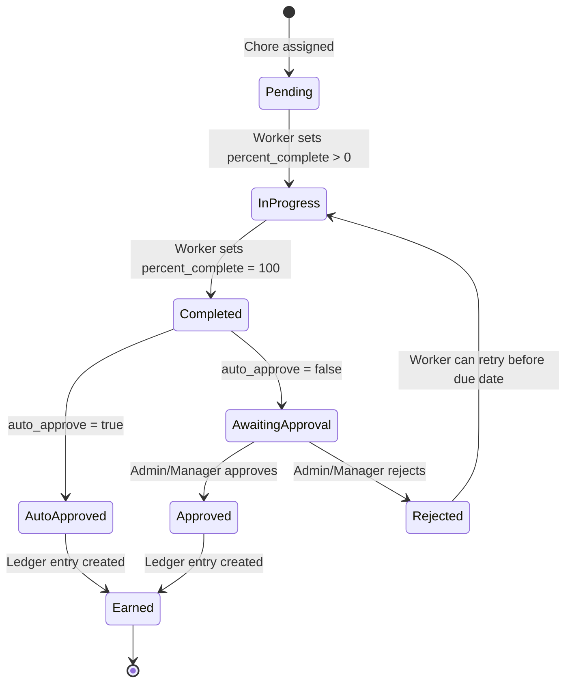
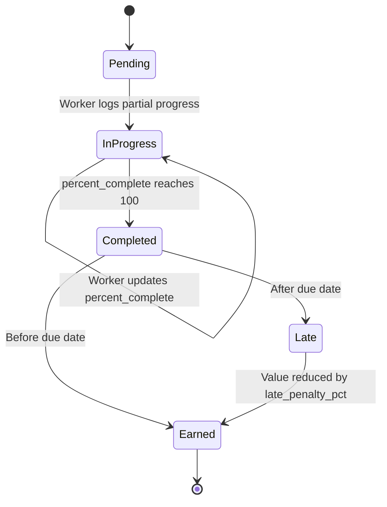
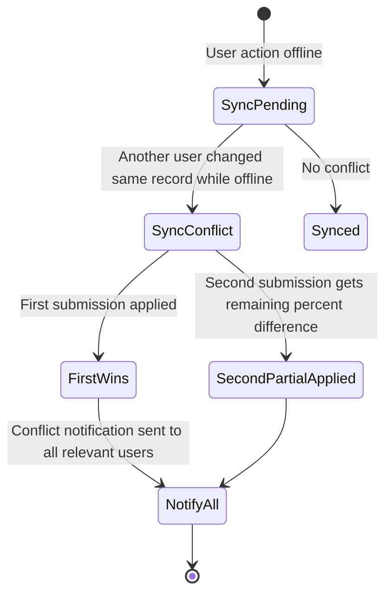

Got it — you want a family-friendly online app that lets you assign chores, track completion, and give points (or money) as decimals.
Let’s start by outlining the core design in **three layers**: **features**, **user experience**, and **technical approach**.

---
# ChoreMe Mobile and Web App

## Introduction
An app to manage chores for family Workers. A progressive web app designed primarily for use on mobile phones but also computers. It will have an easy-to-deploy architecture on Linux, Windows and macOS,  and will be proxied by Caddy for secure sockets and cert support on Linux.

The system should have a system administrator role that is automatically assigned to the first account created. It can administer all other aspects of the system. A system administrator can assign the system administration to any number of users. 

Administrators can create, edit, and delete any objects and entities in the system.


## **1. Core Features**

The app shall be called ChoreMe


### **User Accounts & Roles**

* **Admin**: Usually the parent(s), can add/remove chores, assign chores to Workers, approve completions, set point/money values.

* **Workers**: Anyone in the family who can see their chores, mark them done, and track their earnings.
* All users can edit their own profiles, but only Administrators may delete or disable them.
* Workers may complete Chores that are assigned to them. They may view Earnings and spend Earnings (make the value go down). Earnings may go into the negative values.


### **Chore Management**

* **Add/Edit/Delete Chores**: Each chore has:

  * Title (e.g., "Do the dishes")
  * Description (optional)
  * Assigned to (one or more people)
  * Due date/time
  * Frequency (once, daily, weekly, custom)
  * Point or money value (e.g., `2.5 points` or `$1.25`)
* **Recurring Chores**: Auto-generate daily/weekly chores.
* **Shared Chores**: Multiple people can do it and split points.

### **Tracking & Approval**

* Workers **mark chores as done**.
* Admin can:

  * Auto-approve (trust system) OR
  * Require approval before points are awarded.
* Option for **photo proof** upload (especially for younger kids).

### **Earnings & Rewards**

* Track points/money in decimal format.


### **Notifications**

* Push/email reminders for upcoming chores.
* Alerts when a chore is completed and ready for approval.

---

## **2. User Experience (UX)**

Think **clean, simple, playful** — family-friendly but not childish.

**Home Screen**

* Today’s chores (with checkboxes or swipe-to-complete)
* Current point/money balance
* Quick buttons for “Add Chore” (admin) or “Mark Done” (Workers)

**Chore List View**

* Sort/filter by:

  * Due date
  * Worker
  * Value
  * Completed / pending
* Show icons for repeating chores and late chores

**Progress View**

* Graph of weekly points earned
* Total points/money lifetime
* Leaderboard (optional)

**History**

List of all events affecting each account. Each worker can see their own account, admins can see all accounts.

---

## **3. Technical Approach**

The app is a mobile-first app, which can be usable on a PC. It will allow offline storage that will sync to the back end when reconnected.

### **Frontend**

* **React** or **Vue** (easy to make responsive for mobile)
* **Tailwind CSS** (for quick, consistent styling)
* Use **PWA** features so it can be “installed” like an app on phones

### **Backend**

* SQlite, MySQL or PostgreSQL database
* OR **Supabase** (Postgres + auth + file storage — more SQL control)
* Store chores in structured documents/rows with decimal fields

**Database Example (Chores Table)**:

| id | title          | assigned\_to | value | due\_date  | frequency | completed | approved |
| -- | -------------- | ------------ | ----- | ---------- | --------- | --------- | -------- |
| 1  | Do dishes      | Sam          | 1.25  | 2025-08-11 | daily     | true      | true     |
| 2  | Take out trash | Lily         | 0.5   | 2025-08-12 | weekly    | false     | false    |

### **Extra Touches**

* **Decimal safety**: Use decimal or fixed-point math for money values to avoid floating-point errors.
* **Offline mode**: PWA can store pending chores until internet is available.
* **Gamification**: Badge achievements like “10 chores in a row” or “Chore Ninja”.

---

## **Detailed Feature List for the Chore App**

### **1. User Accounts & Roles**

**Roles**

* **Admin** (parents/guardians):

  * Add, edit, delete chores.
  * Assign chores to Workers.
  * Adjust point/money values.
  * Approve or reject completed chores.
  * Manage reward store.
  * View all family stats and reports.

  
* **Worker** (kids, teens, or adults doing chores):

  * View assigned chores.
  * Mark chores as completed.
  * Attach proof (photo/text).
  * Redeem points/money for rewards.
* Optional: **Observer/Guest**:

  * View stats and chores but cannot complete chores.

**Authentication**

* Email + password login.
* Optional OAuth (Google, Apple, Microsoft).
* Family code / invite system to link accounts under one “household”.

---

### **2. Chore Management**

**Chore Fields**

* **Title** (string, required)
* **Description** (string, optional)
* **Assigned To** (one or more user IDs)
* **Value** (DECIMAL, supports currency or points, e.g. `1.25`)
* **Due Date/Time** (datetime)
* **Frequency**: one-time, daily, weekly, monthly, custom (e.g., every 3 days)
* **Category** (e.g., Cleaning, Pets, Kitchen)
* **Priority** (low, medium, high)
* Auto-approval (Does not require approval by admin)
* **Status**: pending, completed (awaiting approval), approved, rejected

**Chore Features**

* **Recurring Chores**: Auto-create new entries on schedule.
* **Shared Chores**:

  * Split points evenly or assign full value to each person.
* **Randomized Assignment**:

  * Pre-save common chores with all settings for quick re-adding as templates

---

### **3. Completion & Approval Workflow**

**Worker Flow**:

1. User sees chore in their list.
2. Marks as "Done".
3. (Optional) Uploads photo proof.
4. Status changes to **Pending Approval** or auto-approves if set in the chore details.

**Admin Flow**:

1. Gets notification of completion.
2. Can approve (points awarded) or reject (points withheld).
3. Rejection requires reason (e.g., "Trash was still half full").

**Automation Options**:

* Auto-approve chores if set in chore details


---

### **4. Points, Money & Rewards**

**Earning Rules**:

* Decimal support (2 decimal places).
* Option to calculate value dynamically:

  * Example: `$0.50 per 5 minutes vacuumed`.

**Balances**:

* Tracked per user.
* Ledger history of all points/money earned and spent.

**Reward Store**:

* Admin sets rewards (title, cost, description).
* Workers redeem using points or money.


---

### **5. Notifications & Reminders**

* **Push notifications** (via web or mobile):

  * Chore assigned.
  * Chore due soon.
  * Chore completed & awaiting approval.
  * Reward redemption confirmed.
* **Email reminders** for due chores.
* Configurable frequency (e.g., 1 hour before due, morning summary).

---

### **6. Gamification**


* **Badges**:

  * "Chore Streak" — complete X days in a row.
  * "Early Bird" — finish chores before 9 AM.
  * "All Rounder" — complete chores from all categories.
* **Challenges**:

  * Family-wide goals (e.g., “Earn 100 points together this week”).

---

### **7. Reports & Insights**

* Filter by Worker, date range, category, earned value.
* View:

  * Chores completed vs. missed.
  * Points/money earned over time.
  * Most frequently completed chores.
* Export to CSV/PDF.

---

### **8. Database Design (Relational Model)**

**Tables**:

1. **users**

   * id (PK)
   * household\_id (FK)
   * name
   * email
   * password\_hash
   * role (enum: admin, Worker, observer)
   * created\_at, updated\_at

2. **households**

   * id (PK)
   * name
   * invite\_code
   * created\_at

3. **chores**

   * id (PK)
   * household\_id (FK)
   * title
   * description
   * value (DECIMAL(8,2))
   * due\_date
   * frequency (enum or custom JSON)
   * category
   * priority
   * status (pending, completed, approved, rejected)
   * created\_by (FK to users)
   * created\_at, updated\_at

4. **chore\_assignments**

   * id (PK)
   * chore\_id (FK)
   * assigned\_to (FK to users)
   * completed\_at
   * approved\_at
   * proof\_url (optional)
   * approval\_notes
   * created\_at

5. **rewards**

   * id (PK)
   * household\_id (FK)
   * title
   * description
   * cost (DECIMAL(8,2))
   * created\_at

6. **redemptions**

   * id (PK)
   * reward\_id (FK)
   * user\_id (FK)
   * redeemed\_at
   * status (pending, approved, rejected)

7. **ledger**

   * id (PK)
   * user\_id (FK)
   * amount (DECIMAL(8,2))
   * type (earn, spend)
   * description
   * related\_chore\_id (nullable)
   * related\_redemption\_id (nullable)
   * created\_at

---


### Answers to Design Questions


Multiple assignees — Do you want a single chore to be assignable to multiple people at once, with each earning points? Or should one chore only go to one person? ANS: assignable to multiple people at once

Partial completions — Should a chore be able to be “partially completed” with partial points, or is it all-or-nothing? ANS: Partial completion by percentages of the assigned value

Randomization — Do you want the system to auto-distribute chores fairly among family Workers over time? ANS: No

Bulk assignment — Will you want to assign the same chore to multiple days in one step (e.g., “Feed the dog” every day this week)? ANS: Chores should be assignable as As Needed (no Limit), Every Day, Weekly, Monthly, or multiples of each Such as every other day, every 4 weeks, every 3 months

B. Points / Money System
Dual currency — Should users be able to earn both points and money separately, or is it one unified system? ANS: one unified system

Variable value — Should the value of a chore be able to change depending on the day, difficulty, or time taken? ANS: The chore value should remain the same. But a configurable bonus percentage can be applied if completed early or quickly

Negative points — Should points be deducted for missed chores or bad behavior? ANS: Administrators and Parents (known in the system as Managers) can arbitraily add or remove Earnings. For example, a Manager buying something for a Worker and then deducting the value from the Workers's balance.

Automatic payouts — If using money, should the app auto-calculate “payday” amounts weekly/monthly? ANS: No

C. Approval Process
Approval rules — Should some chores bypass approval for trusted Workers? ANS: Yes, all chore completions should be auto accepted

Proof required — Do you want all chores to require photo/video proof, or only some? ANS: Chores can be configured to optionally or be required to require proof.

Auto-expire — Should chores that aren’t completed by the due date disappear, or should they stay visible as “late”? ANS: Yes, Chores can be configured to disappear by a number of days past the due date, or be marked late. Chores that are completed late get a reduced earning by a configurable percentage.

D. Notifications & Reminders
Reminder style — Would you prefer scheduled reminders (e.g., morning summary) or instant notifications for each assigned chore? ANS: The opening screen should list chores that are due with the most urgent ones listed first. A morning summary reminder should also be provided.

Overdue alerts — Should overdue chores trigger extra reminders until done? ANS: yes

Completion alerts — Should admins get notified instantly when a chore is completed, or only in a daily summary? ANS: Instant alerts and daily summaries to Administrators and Managers

E. Rewards & Gamification
Reward store type — Should rewards only be pre-set by admins, or can Workers suggest rewards for approval? ANS: Only set by Admins and Managers

Leaderboards — Do you want visible rankings, or would that cause competitiveness issues? ANS: No leaderboard

Badges — Should badges be purely decorative or worth extra points? ANS: Just decorative

F. Reports & History
Visibility — Should each Worker see only their own chore history, or everyone’s? ANS: Only their own

Exporting — Do you need an “export to CSV” or PDF feature for tracking payouts? ANS: Yes, both CSV and PDF

History editing — Should admins be able to retroactively adjust points for past chores? ANS: Yes, with audit trails

The first version should focus on tight accountability.


## Suggested Next Clarifications Before Final Schema


To make this implementation airtight, I’d clarify a few more edge cases and operational details:

1. Partial Completion Logic
When a chore is partially completed (say 50%), is the system expecting the Worker to report the percentage, or does the Admin set that during approval? ANS: Worker should set the percent complete.

Can partial completions be updated later (e.g., a Worker does 50% now, 50% later the same day)? ANS: They may be updated at any time, but the actions should be logged.

Should partially completed chores still be “due” until fully completed? ANS: Yes

2. Recurring Chore Generation
Should recurring chores generate future instances in advance (e.g., 30 days out) or only appear on the day they are due? ANS: Generate future instances

If a recurring chore is not completed, does the missed instance still get generated for the next period? ANS: Yes. 

3. Late Penalties
Are late penalties percentage of chore value only, or can they also be a flat deduction? ANS: Percentage only

Should the late penalty apply automatically or require admin approval? ANS: Apply automatically

4. Earnings Adjustments
When Managers manually adjust balances, should those adjustments be linked to a reason code (e.g., “bought snacks”) for reporting? ANS: Yes a note should be recorded for all adjustments and spending

Do adjustments appear in the Worker’s ledger the same way chores and rewards do? ANS: Yes

5. Offline Conflict Handling
If two users update the same chore offline and sync later (e.g., one marks done, one marks 50% complete), which change wins? ANS: First submission wins, the second submission gets the remaining difference

Should there be a sync conflict resolution screen? ANS: All users should be notified of a sync conflict

6. Notifications
For morning summaries, should they be sent via push, email, or both? ANS: All summaries should be set optionally in the user profile. One, none or both types can be set.

Do Workers get notified when points are deducted manually by Managers? ANS: Yes

7. Proof Storage
Should photos be stored in the DB as binary or in a file store (local or cloud) with a reference URL in DB? ANS: Blob on the database. But the images must be reduced to no more than a pixel value set in the app configuration before storing.

Is there a size limit or automatic compression? ANS: Yes, the default value should be 500 pixels and only allow JPG or PNG

8. Security & Privacy
Can Workers see any details about chores assigned to others, or is it completely hidden? ANS: Completely hidden

Should audit logs be visible to Workers for their own account actions? ANS: Workers should see all events relevant to their accounts

If you answer these, I can:

Lock in the exact DB schema with table creation SQL

Map workflow state diagrams for chores, earnings, and rewards

Provide API endpoint definitions for CRUD + sync

Do you want me to proceed to final database schema + API blueprint next, or tackle the workflow diagrams first?


### Database DDL
```sql
-- 1. Households
CREATE TABLE households (
    id SERIAL PRIMARY KEY,
    name VARCHAR(100) NOT NULL,
    invite_code VARCHAR(20) UNIQUE,
    created_at TIMESTAMP DEFAULT CURRENT_TIMESTAMP
);

-- 2. Users
CREATE TABLE users (
    id SERIAL PRIMARY KEY,
    household_id INT NOT NULL REFERENCES households(id) ON DELETE CASCADE,
    name VARCHAR(100) NOT NULL,
    email VARCHAR(150) UNIQUE NOT NULL,
    password_hash TEXT NOT NULL,
    role ENUM('system_admin', 'admin', 'manager', 'worker', 'observer') NOT NULL,
    created_at TIMESTAMP DEFAULT CURRENT_TIMESTAMP,
    updated_at TIMESTAMP DEFAULT CURRENT_TIMESTAMP ON UPDATE CURRENT_TIMESTAMP
);

-- 3. Chores
CREATE TABLE chores (
    id SERIAL PRIMARY KEY,
    household_id INT NOT NULL REFERENCES households(id) ON DELETE CASCADE,
    title VARCHAR(200) NOT NULL,
    description TEXT,
    value DECIMAL(8,2) NOT NULL,
    due_date TIMESTAMP NOT NULL,
    frequency VARCHAR(50), -- daily, weekly, monthly, every_X_days, etc.
    category VARCHAR(50),
    priority ENUM('low','medium','high') DEFAULT 'medium',
    auto_approve BOOLEAN DEFAULT FALSE,
    proof_required BOOLEAN DEFAULT FALSE,
    late_penalty_pct DECIMAL(5,2) DEFAULT 0.00, -- percentage
    expire_days INT DEFAULT NULL, -- number of days after due date before disappearing
    created_by INT NOT NULL REFERENCES users(id) ON DELETE SET NULL,
    created_at TIMESTAMP DEFAULT CURRENT_TIMESTAMP,
    updated_at TIMESTAMP DEFAULT CURRENT_TIMESTAMP ON UPDATE CURRENT_TIMESTAMP
);

-- 4. Chore Assignments
CREATE TABLE chore_assignments (
    id SERIAL PRIMARY KEY,
    chore_id INT NOT NULL REFERENCES chores(id) ON DELETE CASCADE,
    assigned_to INT NOT NULL REFERENCES users(id) ON DELETE CASCADE,
    percent_complete DECIMAL(5,2) DEFAULT 0.00,
    completed_at TIMESTAMP NULL,
    approved_at TIMESTAMP NULL,
    proof_image BLOB, -- stored in DB, resized before save
    approval_notes TEXT,
    status ENUM('pending','completed','approved','rejected') DEFAULT 'pending',
    created_at TIMESTAMP DEFAULT CURRENT_TIMESTAMP,
    updated_at TIMESTAMP DEFAULT CURRENT_TIMESTAMP ON UPDATE CURRENT_TIMESTAMP
);

-- 5. Rewards
CREATE TABLE rewards (
    id SERIAL PRIMARY KEY,
    household_id INT NOT NULL REFERENCES households(id) ON DELETE CASCADE,
    title VARCHAR(200) NOT NULL,
    description TEXT,
    cost DECIMAL(8,2) NOT NULL,
    created_at TIMESTAMP DEFAULT CURRENT_TIMESTAMP
);

-- 6. Redemptions
CREATE TABLE redemptions (
    id SERIAL PRIMARY KEY,
    reward_id INT NOT NULL REFERENCES rewards(id) ON DELETE CASCADE,
    user_id INT NOT NULL REFERENCES users(id) ON DELETE CASCADE,
    redeemed_at TIMESTAMP DEFAULT CURRENT_TIMESTAMP,
    status ENUM('pending','approved','rejected') DEFAULT 'pending'
);

-- 7. Ledger
CREATE TABLE ledger (
    id SERIAL PRIMARY KEY,
    user_id INT NOT NULL REFERENCES users(id) ON DELETE CASCADE,
    amount DECIMAL(8,2) NOT NULL,
    type ENUM('earn','spend','adjust') NOT NULL,
    description TEXT,
    related_chore_id INT REFERENCES chores(id) ON DELETE SET NULL,
    related_redemption_id INT REFERENCES redemptions(id) ON DELETE SET NULL,
    created_at TIMESTAMP DEFAULT CURRENT_TIMESTAMP
);

-- 8. Audit Logs (Events)
CREATE TABLE audit_logs (
    id SERIAL PRIMARY KEY,
    household_id INT NOT NULL REFERENCES households(id) ON DELETE CASCADE,
    user_id INT NOT NULL REFERENCES users(id) ON DELETE CASCADE,
    action VARCHAR(100) NOT NULL,
    details TEXT,
    created_at TIMESTAMP DEFAULT CURRENT_TIMESTAMP
);
```


Perfect — your answers close all the major design gaps.
With these clarified, we can now finalize **two deliverables** that will make ChoreMe implementation straightforward:

1. **Final relational database schema (with SQL create table statements)**
2. **API + workflow blueprint** for how chores, earnings, and sync should operate.

---

## **1. Final Database Schema (SQL DDL)**

Below is the PostgreSQL/MySQL-compatible schema reflecting your rules, roles, and logging requirements.

```sql
-- 1. Households
CREATE TABLE households (
    id SERIAL PRIMARY KEY,
    name VARCHAR(100) NOT NULL,
    invite_code VARCHAR(20) UNIQUE,
    created_at TIMESTAMP DEFAULT CURRENT_TIMESTAMP
);

-- 2. Users
CREATE TABLE users (
    id SERIAL PRIMARY KEY,
    household_id INT NOT NULL REFERENCES households(id) ON DELETE CASCADE,
    name VARCHAR(100) NOT NULL,
    email VARCHAR(150) UNIQUE NOT NULL,
    password_hash TEXT NOT NULL,
    role ENUM('system_admin', 'admin', 'manager', 'worker', 'observer') NOT NULL,
    created_at TIMESTAMP DEFAULT CURRENT_TIMESTAMP,
    updated_at TIMESTAMP DEFAULT CURRENT_TIMESTAMP ON UPDATE CURRENT_TIMESTAMP
);

-- 3. Chores
CREATE TABLE chores (
    id SERIAL PRIMARY KEY,
    household_id INT NOT NULL REFERENCES households(id) ON DELETE CASCADE,
    title VARCHAR(200) NOT NULL,
    description TEXT,
    value DECIMAL(8,2) NOT NULL,
    due_date TIMESTAMP NOT NULL,
    frequency VARCHAR(50), -- daily, weekly, monthly, every_X_days, etc.
    category VARCHAR(50),
    priority ENUM('low','medium','high') DEFAULT 'medium',
    auto_approve BOOLEAN DEFAULT FALSE,
    proof_required BOOLEAN DEFAULT FALSE,
    late_penalty_pct DECIMAL(5,2) DEFAULT 0.00, -- percentage
    expire_days INT DEFAULT NULL, -- number of days after due date before disappearing
    created_by INT NOT NULL REFERENCES users(id) ON DELETE SET NULL,
    created_at TIMESTAMP DEFAULT CURRENT_TIMESTAMP,
    updated_at TIMESTAMP DEFAULT CURRENT_TIMESTAMP ON UPDATE CURRENT_TIMESTAMP
);

-- 4. Chore Assignments
CREATE TABLE chore_assignments (
    id SERIAL PRIMARY KEY,
    chore_id INT NOT NULL REFERENCES chores(id) ON DELETE CASCADE,
    assigned_to INT NOT NULL REFERENCES users(id) ON DELETE CASCADE,
    percent_complete DECIMAL(5,2) DEFAULT 0.00,
    completed_at TIMESTAMP NULL,
    approved_at TIMESTAMP NULL,
    proof_image BLOB, -- stored in DB, resized before save
    approval_notes TEXT,
    status ENUM('pending','completed','approved','rejected') DEFAULT 'pending',
    created_at TIMESTAMP DEFAULT CURRENT_TIMESTAMP,
    updated_at TIMESTAMP DEFAULT CURRENT_TIMESTAMP ON UPDATE CURRENT_TIMESTAMP
);

-- 5. Rewards
CREATE TABLE rewards (
    id SERIAL PRIMARY KEY,
    household_id INT NOT NULL REFERENCES households(id) ON DELETE CASCADE,
    title VARCHAR(200) NOT NULL,
    description TEXT,
    cost DECIMAL(8,2) NOT NULL,
    created_at TIMESTAMP DEFAULT CURRENT_TIMESTAMP
);

-- 6. Redemptions
CREATE TABLE redemptions (
    id SERIAL PRIMARY KEY,
    reward_id INT NOT NULL REFERENCES rewards(id) ON DELETE CASCADE,
    user_id INT NOT NULL REFERENCES users(id) ON DELETE CASCADE,
    redeemed_at TIMESTAMP DEFAULT CURRENT_TIMESTAMP,
    status ENUM('pending','approved','rejected') DEFAULT 'pending'
);

-- 7. Ledger
CREATE TABLE ledger (
    id SERIAL PRIMARY KEY,
    user_id INT NOT NULL REFERENCES users(id) ON DELETE CASCADE,
    amount DECIMAL(8,2) NOT NULL,
    type ENUM('earn','spend','adjust') NOT NULL,
    description TEXT,
    related_chore_id INT REFERENCES chores(id) ON DELETE SET NULL,
    related_redemption_id INT REFERENCES redemptions(id) ON DELETE SET NULL,
    created_at TIMESTAMP DEFAULT CURRENT_TIMESTAMP
);

-- 8. Audit Logs (Events)
CREATE TABLE audit_logs (
    id SERIAL PRIMARY KEY,
    household_id INT NOT NULL REFERENCES households(id) ON DELETE CASCADE,
    user_id INT NOT NULL REFERENCES users(id) ON DELETE CASCADE,
    action VARCHAR(100) NOT NULL,
    details TEXT,
    created_at TIMESTAMP DEFAULT CURRENT_TIMESTAMP
);
```

---

## **2. Workflow Blueprints**

### **Chore Lifecycle**

```
[Assigned] → (Worker sets % complete) → [Pending Approval / Auto-Approved]
   ↳ If proof required, attach image
   ↳ Late completion = apply penalty %
   ↳ If partially complete, remains "due" until 100%
   ↳ Admin can override or adjust %
```

**Recurring Chores**

* Generated in advance for X days (configurable).
* Missed chores still generate new ones in next cycle.

---

### **Earnings Flow**

1. Worker completes chore → Ledger entry `type='earn'`.
2. Reward redeemed → Ledger entry `type='spend'`.
3. Manager adjusts → Ledger entry `type='adjust'` with note.
4. Negative balances allowed.

---

### **Offline Sync Conflict Resolution**

* First submission wins; second submission’s % applied to remaining value.
* All affected users notified of conflict via push/email.

---

### **Notifications**

* User preference: push, email, both, or none.
* Morning summary = due + overdue chores sorted by urgency.
* Instant alerts for:

  * Completion
  * Manager adjustments
  * Sync conflicts

---

### **Proof Image Handling**

* Stored in DB as compressed JPG/PNG.
* Resized to max pixel dimension from app config (default: 500px).
* Format validation before save.

---

If you want, I can now produce a **complete API spec** (REST/JSON) for:

* Authentication & household linking
* CRUD for chores, assignments, rewards
* Sync endpoints for offline use
* Ledger & audit retrieval


---

# **ChoreMe API Specification (v1)**

**ChoreMe API specification**  as a **REST+JSON** API, with endpoints grouped by functional area, plus payload examples, validation rules, and relevant permissions.

## **General API Notes**

* **Auth**: JWT-based authentication; `Authorization: Bearer <token>` required unless noted.
* **Content Type**: `application/json` for all requests & responses.
* **Timestamps**: ISO 8601 format (UTC).
* **Decimal Fields**: Strings in JSON (e.g., `"1.25"`) to avoid float precision loss.
* **Permissions**:

  * **System Admin**: Can manage everything across households.
  * **Admin/Manager**: Can manage all objects in their household.
  * **Worker**: Can view & act only on own chores, rewards, and ledger.
  * **Observer**: Read-only household data.

---

## **1. Authentication & Accounts**

### **POST /auth/register**

Create a new account; first registered account = `system_admin`.

**Body**

```json
{
  "household_name": "The Johnsons",
  "name": "Alice Johnson",
  "email": "alice@example.com",
  "password": "StrongPass123"
}
```

**Response**

```json
{
  "token": "<jwt>",
  "user": { "id": 1, "role": "system_admin", "name": "Alice Johnson" }
}
```

---

### **POST /auth/login**

Authenticate and return a token.

**Body**

```json
{
  "email": "alice@example.com",
  "password": "StrongPass123"
}
```

**Response**

```json
{ "token": "<jwt>" }
```

---

### **POST /households/invite**

(Admin/Manager) Generate household invite code.

**Response**

```json
{ "invite_code": "ABCD1234" }
```

---

### **POST /households/join**

Join household using invite code.

**Body**

```json
{
  "invite_code": "ABCD1234",
  "name": "Bobby Johnson",
  "email": "bobby@example.com",
  "password": "KidPass456"
}
```

---

## **2. Chores**

### **GET /chores**

List chores for household; Workers see only their own.

**Query Params**

* `status` (optional): pending, completed, approved, rejected
* `due_before` / `due_after`
* `assigned_to`

---

### **POST /chores**

(Admin/Manager) Create a chore.

**Body**

```json
{
  "title": "Do dishes",
  "description": "Wash and dry all dishes",
  "value": "1.50",
  "due_date": "2025-08-12T18:00:00Z",
  "frequency": "daily",
  "category": "Kitchen",
  "priority": "medium",
  "auto_approve": false,
  "proof_required": true,
  "late_penalty_pct": "20.00",
  "expire_days": 2,
  "assigned_to": [2, 3]
}
```

---

### **PATCH /chores/{id}**

Update chore details.

---

### **DELETE /chores/{id}**

Delete chore.

---

## **3. Chore Assignments**

### **PATCH /assignments/{id}/progress**

(Worker) Update percentage completion.

**Body**

```json
{ "percent_complete": "50.00" }
```

---

### **PATCH /assignments/{id}/complete**

Mark as completed.

**Body**

```json
{
  "percent_complete": "100.00",
  "proof_image": "<base64encodedimage>"
}
```

---

### **PATCH /assignments/{id}/approve**

(Admin/Manager) Approve chore.

**Body**

```json
{ "approval_notes": "Great job!" }
```

---

### **PATCH /assignments/{id}/reject**

(Admin/Manager) Reject chore.

**Body**

```json
{ "approval_notes": "Still dirty spots" }
```

---

## **4. Earnings & Ledger**

### **GET /ledger**

List transactions for current user (Admins see all).

**Query Params**

* `user_id`
* `type` = earn, spend, adjust
* `date_from`, `date_to`

---

### **POST /ledger/adjust**

(Admin/Manager) Manual adjustment.

**Body**

```json
{
  "user_id": 3,
  "amount": "-5.00",
  "description": "Bought snacks"
}
```

---

## **5. Rewards**

### **GET /rewards**

List household rewards.

---

### **POST /rewards**

(Admin/Manager) Create reward.

**Body**

```json
{
  "title": "Movie Night",
  "description": "Pick the Friday movie",
  "cost": "10.00"
}
```

---

### **POST /rewards/{id}/redeem**

(Worker) Redeem reward.

---

## **6. Reports**

### **GET /reports/chores**

(Admin/Manager) Chores completed vs missed.

---

### **GET /reports/earnings**

(Admin/Manager) Earnings by user/date range.

---

## **7. Notifications**

### **GET /notifications**

List notifications for user.

---

### **PATCH /notifications/{id}/read**

Mark as read.

---

## **8. Audit Logs**

### **GET /audit**

(Admin/Manager) View household audit logs.

**Query Params**

* `user_id`
* `action`
* `date_from`, `date_to`

---


## **1. Chore Completion & Approval Flow**


 **state flow diagrams in text form** 



---

## **2. Partial Completion & Late Penalty Flow**



**Notes:**

* If late penalty = 20% and chore worth \$5.00, late completion earns \$4.00 automatically.
* All partial updates are logged in audit trail.

---

## **3. Offline Sync Conflict Resolution Flow**



---

### Combined blueprint


Perfect — here’s the **ChoreMe System Blueprint** combining your database plan, API spec, and workflows into one developer-ready document.
This will be long but cleanly organized so your dev can open it and immediately start building.

---

# **ChoreMe System Blueprint**

Version 1.0 – 2025-08-11

---

## **1. Overview**

ChoreMe is a **family chore tracking app** with:

* Chore assignments
* Points/money rewards
* Partial completion
* Recurring generation
* Auto late penalties
* Offline sync conflict handling
* Photo proof storage (with compression)
* Audit logs

Supports roles:

* **System Admin** – global control
* **Household Admin/Manager** – manage their household
* **Worker** – complete chores, redeem rewards
* **Observer** – read-only

---

## **2. Database Schema (PostgreSQL)**

### **households**

| Column      | Type      | Notes       |
| ----------- | --------- | ----------- |
| id          | serial pk |             |
| name        | text      |             |
| created\_at | timestamp | default now |

### **users**

| Column                    | Type                                                  | Notes |
| ------------------------- | ----------------------------------------------------- | ----- |
| id                        | serial pk                                             |       |
| household\_id             | int fk                                                |       |
| name                      | text                                                  |       |
| email                     | text unique                                           |       |
| password\_hash            | text                                                  |       |
| role                      | enum(system\_admin, admin, manager, worker, observer) |       |
| notification\_pref\_email | boolean                                               |       |
| notification\_pref\_push  | boolean                                               |       |

### **chores**

| Column             | Type                                 | Notes           |
| ------------------ | ------------------------------------ | --------------- |
| id                 | serial pk                            |                 |
| household\_id      | int fk                               |                 |
| title              | text                                 |                 |
| description        | text                                 |                 |
| value              | numeric(10,2)                        | points or money |
| frequency          | enum(daily, weekly, monthly, custom) |                 |
| category           | text                                 |                 |
| priority           | enum(low, medium, high)              |                 |
| auto\_approve      | boolean                              |                 |
| proof\_required    | boolean                              |                 |
| late\_penalty\_pct | numeric(5,2)                         |                 |
| expire\_days       | int                                  |                 |

### **assignments**

| Column            | Type                                                             | Notes                    |
| ----------------- | ---------------------------------------------------------------- | ------------------------ |
| id                | serial pk                                                        |                          |
| chore\_id         | int fk                                                           |                          |
| assigned\_to      | int fk(users)                                                    |                          |
| due\_date         | timestamp                                                        |                          |
| percent\_complete | numeric(5,2)                                                     | default 0                |
| status            | enum(pending, in\_progress, completed, approved, rejected, late) |                          |
| proof\_image      | bytea                                                            | compressed before insert |
| approval\_notes   | text                                                             |                          |
| created\_at       | timestamp                                                        | default now              |
| updated\_at       | timestamp                                                        | default now              |

### **ledger**

| Column                | Type                      | Notes                |
| --------------------- | ------------------------- | -------------------- |
| id                    | serial pk                 |                      |
| user\_id              | int fk                    |                      |
| type                  | enum(earn, spend, adjust) |                      |
| amount                | numeric(10,2)             | positive or negative |
| description           | text                      |                      |
| chore\_assignment\_id | int fk(assignments)       | nullable             |
| created\_at           | timestamp                 | default now          |

### **rewards**

| Column        | Type          | Notes |
| ------------- | ------------- | ----- |
| id            | serial pk     |       |
| household\_id | int fk        |       |
| title         | text          |       |
| description   | text          |       |
| cost          | numeric(10,2) |       |

### **audit\_logs**

| Column        | Type      | Notes       |
| ------------- | --------- | ----------- |
| id            | serial pk |             |
| household\_id | int fk    |             |
| user\_id      | int fk    |             |
| action        | text      |             |
| details       | jsonb     |             |
| created\_at   | timestamp | default now |

---

## **3. API Specification**

(Condensed here; full version in earlier section)

**Core Endpoints:**

* **Auth**: `/auth/register`, `/auth/login`, `/households/invite`, `/households/join`
* **Chores**: `/chores`, `/chores/{id}`, `/assignments/{id}/progress`, `/assignments/{id}/complete`, `/assignments/{id}/approve`, `/assignments/{id}/reject`
* **Ledger**: `/ledger`, `/ledger/adjust`
* **Rewards**: `/rewards`, `/rewards/{id}/redeem`
* **Reports**: `/reports/chores`, `/reports/earnings`
* **Notifications**: `/notifications`, `/notifications/{id}/read`
* **Audit Logs**: `/audit`

---

## **4. State Diagrams**

### **4.1 Chore Completion & Approval**


---

### **4.2 Partial Completion & Late Penalty**


---

### **4.3 Offline Sync Conflict Resolution**


---

## **5. Workflow Example – Assign → Complete → Approve**

**1. Admin assigns chore**

```http
POST /chores
{
  "title": "Vacuum Living Room",
  "value": "3.00",
  "due_date": "2025-08-12T18:00:00Z",
  "assigned_to": [5],
  "late_penalty_pct": "10.00",
  "auto_approve": false,
  "proof_required": true
}
```

**2. Worker completes chore**

```http
PATCH /assignments/10/complete
{
  "percent_complete": "100.00",
  "proof_image": "<base64>"
}
```

**3. Admin approves**

```http
PATCH /assignments/10/approve
{ "approval_notes": "Looks good!" }
```

**4. Ledger updates**

```json
{
  "id": 44,
  "type": "earn",
  "amount": "3.00",
  "description": "Chore: Vacuum Living Room",
  "created_at": "2025-08-12T18:30:00Z"
}
```

---

## **6. Security Rules**

* Workers can only see their own chores, ledger, and rewards.
* All photo proof is resized to 500px max before storage, JPG/PNG only.
* Every action logged in `audit_logs`.

---

## **7. Implementation Notes**

* **DB choice**: PostgreSQL recommended for JSONB fields + strong transaction handling.
* **Images**: Use a preprocessing step to compress before DB insert.
* **Recurring Chores**: Cron job or background worker to generate instances 30 days ahead.
* **Offline Mode**: Local IndexedDB/WebSQL in browser or SQLite in mobile; sync on reconnect.

---

If you want, I can **extend this with actual SQL table creation scripts + starter API code in FastAPI or Express.js** so it’s not just a blueprint but a **ready-to-run MVP backend**.
Do you want me to prepare that next?


13. Next steps I can take for you (pick one)
Produce a complete starter repo (files above implemented, ready to go run) — I’ll generate all files.

Create sqlc queries and generated types for strongly-typed DB access.

Generate a Postman collection / OpenAPI spec (Swagger) matching the handlers above.

Build the React PWA frontend scaffold that consumes this API.


